# Ark Manager

DLsite, Steam, VNDB, Getchu 게임과 로컬 미디어 라이브러리를 한 곳에서 관리하는 Windows용 데스크톱 앱입니다. PC에 흩어져 있는 온갖 동인 소프트웨어를 쉽게 관리하고 실행할 수 있도록 만들었습니다.

폴더를 라이브러리로 등록하면 `RJ`/`VJ`(DLsite), `ST`(Steam), `VNV`/`VNR`(VNDB), `GC`(Getchu) 식별 코드를 자동으로 인식하고, 표지·제목·제작사·발매일·태그 같은 메타데이터를 조회해 보여줍니다. 같은 식별 코드를 가진 파일은 메모, 평점, 세이브 백업 등 관리 데이터를 서로 공유합니다.

## 스크린샷으로 보는 주요 기능

### 파일 뷰어 - Gallery / List / DetailList

세 가지 방식 중 원하는 방식으로 라이브러리를 볼 수 있습니다.

<p align="center">
  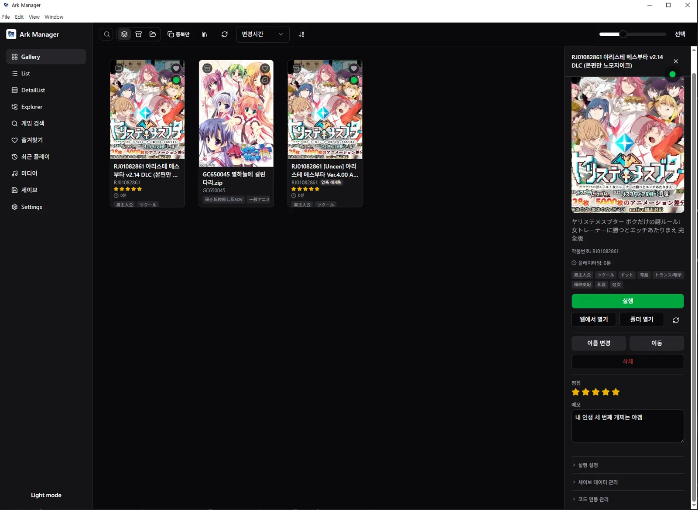
</p>
<p align="center">
  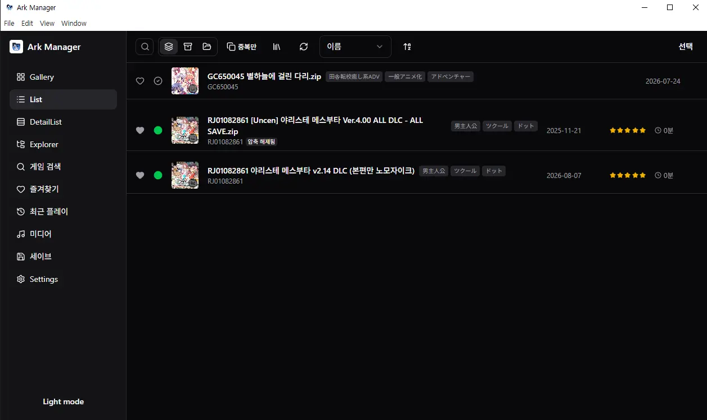
  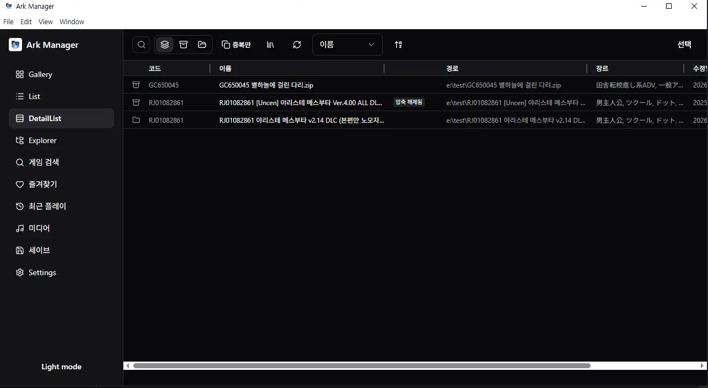
</p>

### 식별코드 기반 데이터 관리

DLsite(RJ, VJ), Steam(ST), VNDB(VNV, VNR), Getchu(GC) — 각각 알파벳으로 시작하는 식별코드로 데이터를 관리합니다. 같은 식별코드의 파일들은 메모, 평점, 세이브 백업 등을 서로 공유합니다.

<p align="center">
  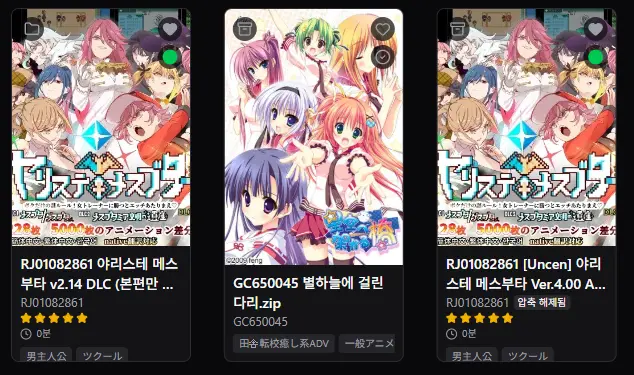
</p>

### 세이브 백업

게임을 다 클리어했거나 여러 루트를 보고 싶을 때, 세이브 파일만 따로 Ark Manager가 저장해 둘 수 있습니다. 게임을 지웠다 다시 설치해도 원상복구가 가능합니다. 단, 세이브 파일 위치는 직접 등록해야 합니다. (일부 게임은 지원하지 않을 수 있습니다.)

<p align="center">
  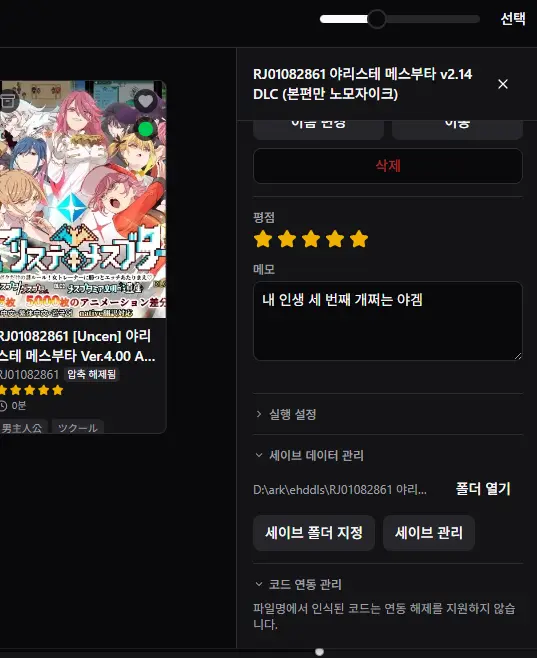
</p>
<p align="center">
  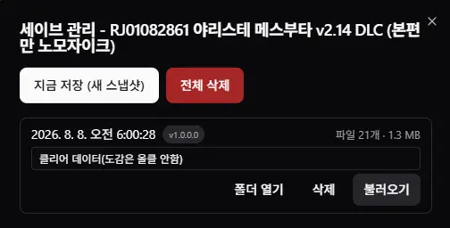
</p>

### 미디어 재생 기능

음성 파일(mp3, flac, wav, m4a)이나 영상 파일(mp4, mkv)을 재생할 수 있습니다. 뷰어와는 별개의 창으로 열리며, 음성 파일에 `.lrc` 같은 자막 파일이 있으면 자막을 함께 띄워줍니다. 재생목록 기반 랜덤 재생, 한 곡 반복재생, 팝업 창으로 열기 등 다양한 기능을 지원합니다. 동인 음성 감상용으로도, 버튜버 콘서트 영상 감상용으로도 사용하고 있습니다.

<p align="center">
  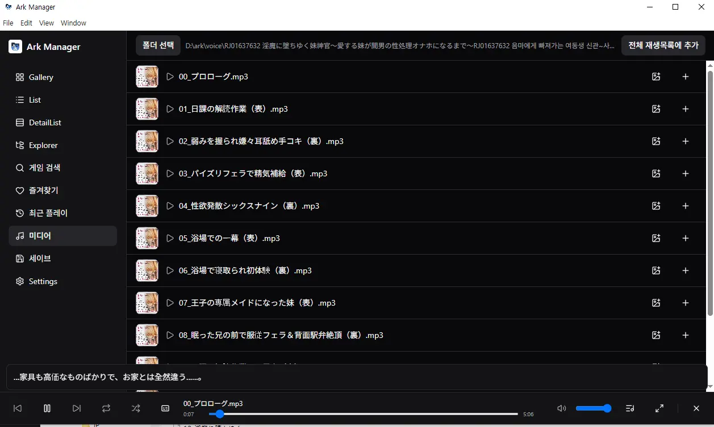
</p>
<p align="center">
  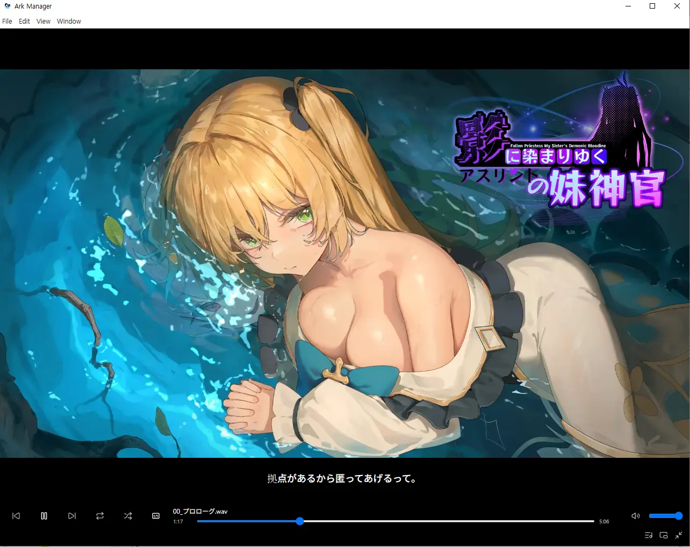
  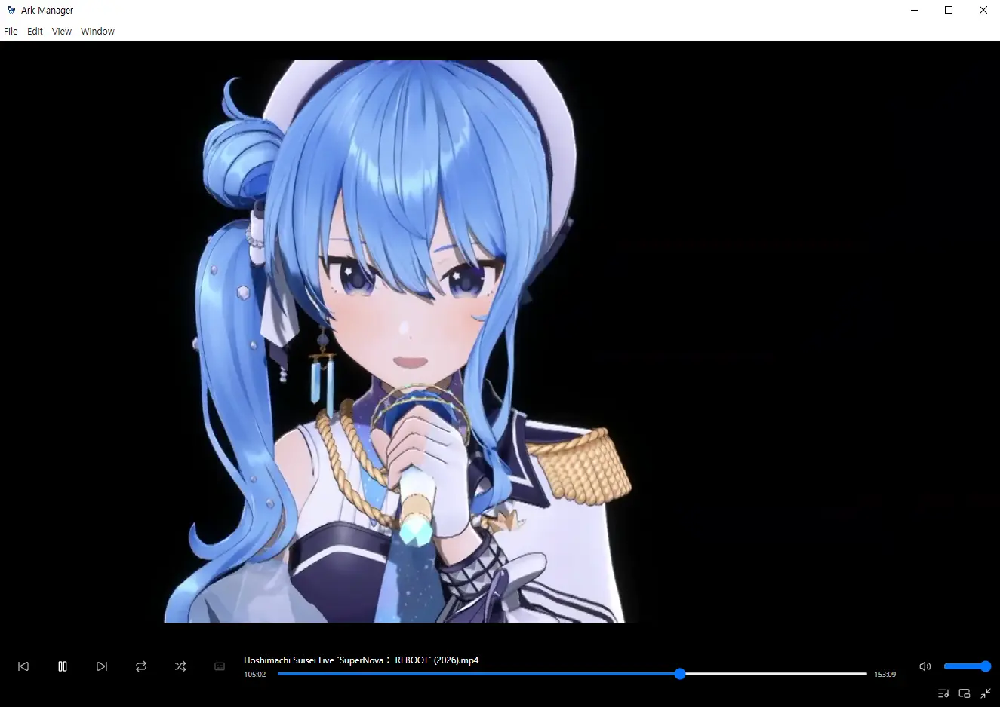
</p>
<p align="center">
  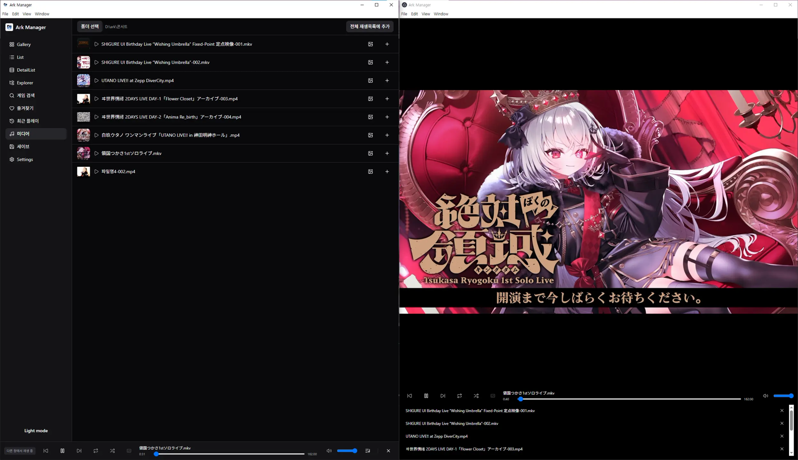
</p>


### DLsite / Steam / VNDB / Getchu 통합 검색

제목으로도, 식별코드로도 검색할 수 있습니다.

<p align="center">
  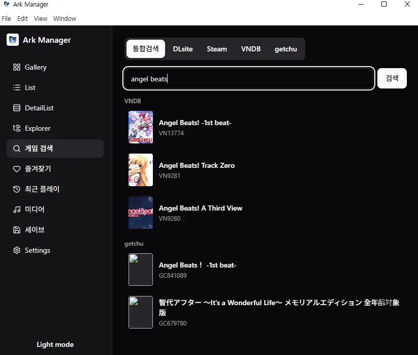
</p>

### 파일 탐색기 (Explorer)

간단한 파일탐색 기능을 제공합니다. 리스트/타일 보기가 가능하고, 드래그 앤 드롭으로 폴더째 파일 이동도 됩니다. 사이드바가 안 보이면 검색 버튼 오른쪽 아이콘을 눌러 다시 켤 수 있습니다.

### 플레이타임 기록

Ark Manager로 실행한 게임은 종료 시점에 플레이타임이 기록됩니다. 스팀처럼 "이 게임 깨는 데 몇 시간 걸렸는지" 확인할 수 있습니다. 단, 게임이 켜진 채로 Ark Manager를 먼저 종료하면 게임도 함께 꺼지면서 기록되지 않으니 주의하세요.

### 썸네일 변경

원하는 이미지로 손쉽게 표지(썸네일)를 바꿀 수 있습니다. 썸네일이 없으면 같은 폴더의 첫 번째 이미지를 자동으로 보여줍니다. WAV 파일은 자체적으로는 표지를 저장할 수 없지만, 대신 프로그램 내부에서 표지를 지정할 수 있습니다.

## 업데이트 내역

### 1.1.1 (2026.08.09)

원래는 프로그램 창을 닫기 버튼으로 닫으면 항상 시스템 트레이에 남아있었는데, 이제 종료할지 트레이로 보낼지 선택할 수 있습니다.

<p align="center">
  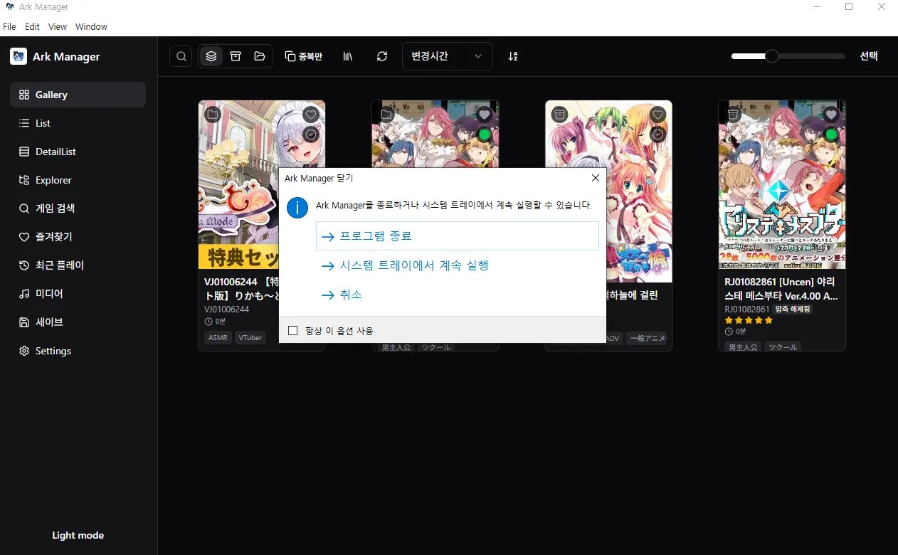
  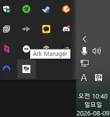
</p>

### 1.1.0 (2026.08.08)

**미디어 기능 개선**

- 미디어 재생 시 설정한 음량과 실제 재생 음량이 다르던 문제 수정
- 미디어 랜덤 재생 기능 추가 (전체 미디어를 한 번씩 순회한 뒤 다시 랜덤 재생)
- Explorer를 새로고침해도 재생 중인 미디어가 끊기지 않도록 개선 (파일 목록만 갱신, 재생 상태는 유지)
- 미디어 목록에 썸네일 표시 기능 추가 (영상은 프레임을 추출, 음악은 파일 자체에 저장해서 관리)
- `.lrc` 같은 자막 파일이 있는 미디어의 자막 표시 및 ON/OFF 기능 추가

**Explorer 개선**

- Gallery, List, DetailList 등 전반적인 UI 및 기능 개선, 컴포넌트 스타일 통일
- Toast 알림 스타일 및 동작 통일
- 파일/폴더 우클릭 메뉴에서 특정 항목을 목록에서 제외하는 기능 추가 (파일이 삭제되는 건 아닙니다)
- View 메뉴의 제외 항목 관리에서 숨긴 항목을 확인하고 다시 표시할 수 있음

  <p align="center">
    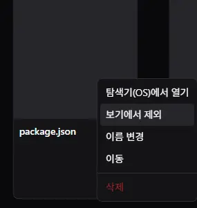
    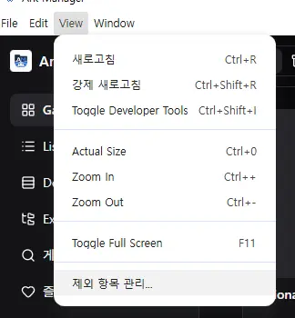
  </p>

- 검색 버튼 확장 영역에 태그 입력 필드 통합, 함께 확장/축소되도록 개선
- 일괄 이름 변경 후 선택 모드가 해제되지 않던 문제 수정
- Explorer 아이콘 정렬/간격, 목록 전환 애니메이션, 탭 추가·제거 애니메이션 개선
- Grid View 선택 모드에서 콘텐츠 위치가 밀리는 문제, 검색 중 줌 슬라이더가 비활성화되는 문제 수정
- 키보드 포커스 및 조작 개선

**게임 메타데이터 및 식별 기능 개선**

- VNDB의 v 코드와 r 코드를 서로 다른 식별자로 분리 처리 (다른 작품 정보를 잘못 가져오던 문제 수정)
- VNDB, Getchu 기반 게임 식별 및 메타데이터 연동 추가, 사이트별 식별코드에 맞춰 조회
- 메타데이터 새로고침 시 Gallery, List, DetailList 등에 변경 사항 즉시 반영

**즐겨찾기 개선**

- 즐겨찾기 페이지가 게임 단위로만 표시되도록 변경 (개별 파일이 각각 표시되거나 동일 게임이 중복 표시되던 문제 수정)
- 즐겨찾기에서 게임 선택 시 해당 식별번호로 Gallery 검색 화면으로 이동

**세이브 관리 기능 추가 및 개선**

- 세이브 파일 및 세이브 스냅샷 관리, 삭제 기능 추가
- 세이브 파일 위치를 파일 탐색기로 바로 열 수 있는 기능 추가
- 세이브 스냅샷이 없는 게임은 세이브 목록에서 숨김

**파일 및 실행 기능 개선**

- 파일 확장자에 따라 사용 가능한 기능 구분 (압축파일이 아닌 일반 파일은 평점/메모/코드 연동 비활성화)
- `.exe`는 Explorer에서 직접 실행, 미디어 파일은 미디어 탭에서 실행하도록 동작 분리
- `.7z`, `.rar`, `.zip`, `.egg` 등 압축파일 상태 처리 개선 (압축 해제 기능은 아직 없습니다)

**중복 게임 표시 개선**

- 동일한 종류의 파일끼리만 중복 표시가 발생하도록 변경
- 압축파일과 압축 해제된 폴더가 함께 있으면 압축파일에 "압축 해제됨" 상태 표시

**Drag & Drop / 폴더 트리 사이드바 개선**

- UNC 경로 처리 개선, 드라이브 루트와 UNC 루트의 경로 반환 형식 통일
- 라이브러리 외부 탭에 드롭했을 때 아무 피드백 없이 무시되던 문제 수정
- 사이드바 설정을 불러오기 전 잠깐 열린 상태로 보이던 문제, 불필요한 렌더링 수정

**UI 및 안정성 개선**

- 전체 UI 디자인 및 컴포넌트 스타일 통일, Toast/알림 UI 통일
- 상세 페이지 실행 버튼 색상 및 버튼 배치 정리
- 화면 전환 및 메타데이터 반영 처리 개선, 중복 표시 문제 다수 수정

### 1.0.1 (2026.08.02)

- **자동 업데이트 지원**: 새 버전이 나오면 앱 안에서 확인 → 다운로드 → 설치까지 바로 할 수 있습니다. 설정 페이지에 업데이트 확인 버튼이 추가됐고, 다운로드가 끝나면 업데이트 내역(패치노트) 창이 자동으로 뜹니다.
- **설치 경로 직접 선택 가능**: 설치 시 원하는 폴더를 직접 지정할 수 있습니다. (관리자 권한 없이 설치되는 방식은 그대로 유지)
- **버전 표시 추가**: 설정 페이지 하단에 현재 설치된 버전이 표시됩니다.

<p align="center">
  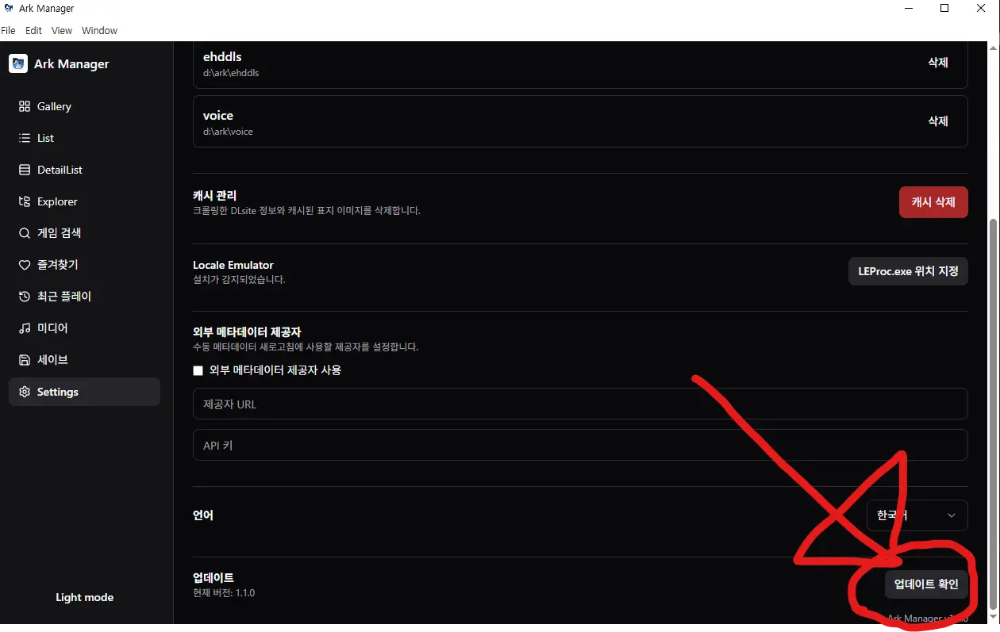
</p>

**버그 수정**

- 갤러리 화면에서 창 크기를 조절하다가 특정 상황에 앱이 튕기는 문제 수정
- 파일 선택 후 이름변경/삭제/이동 창을 연달아 열 때 창끼리 상태가 꼬이던 문제 수정

**업데이트 방법**

- 기존 사용자: 설정 → 업데이트 확인을 누르면 자동으로 받을 수 있습니다.
- 신규 설치: [릴리즈 페이지](https://github.com/kth5352/ArkManager/releases)에서 최신 설치 파일을 받으시면 됩니다.

## 추후 개발 예정

- 지역 제한이 적용된 게임도 메타데이터를 조회할 수 있도록 관련 기능 개선
- 미디어 재생기 개선 (아직은 폴더를 하나씩만 열어볼 수 있음. Explorer와 연동하면 편리할 것 같습니다)
- 파일명 일괄 변경에 AI 탑재 검토 중
- Steam API 연동으로 라이브러리의 Steam 게임을 실행·다운로드·조회할 수 있도록 시도 예정 (시기 미정)

> 스크린샷은 계속 추가할 예정입니다. 위 항목 중 일부는 아직 스크린샷이 없습니다.

## 기술 스택

- [Electron](https://www.electronjs.org/) + [electron-vite](https://electron-vite.org/)
- React 19 + TypeScript (strict)
- Tailwind CSS v4 + shadcn/ui
- Zustand · TanStack Query · TanStack Router
- Drizzle ORM + better-sqlite3
- react-window (가상 스크롤) · Vitest

## 시작하기

### 요구 사항

- Node.js (버전은 `.nvmrc` 참고)
- Windows (better-sqlite3 네이티브 모듈 빌드를 위한 빌드 도구 필요)

### 개발 모드

```bash
npm install
npm run dev
```

### 프로덕션 빌드 (설치 파일 생성)

```bash
npm run build
```

`electron-vite build`로 렌더러/메인 프로세스를 빌드한 뒤 `electron-builder`로 Windows NSIS 설치 파일을 만듭니다. 결과물은 `dist/`에 생성됩니다 (`dist/win-unpacked/`에 압축 안 된 실행 파일, `dist/Ark Manager Setup {version}.exe`에 설치 파일).

## 스크립트

| 명령                   | 설명                          |
| ---------------------- | ----------------------------- |
| `npm run dev`          | 개발 모드 실행 (HMR)          |
| `npm run build`        | 프로덕션 빌드 + 패키징        |
| `npm run lint`         | ESLint                        |
| `npm run typecheck`    | TypeScript 프로젝트 참조 빌드 |
| `npm run test`         | Vitest                        |
| `npm run format`       | Prettier로 포맷               |
| `npm run format:check` | 포맷 검사만                   |

## 프로젝트 구조

```
electron/
  main/       # 메인 프로세스 - IPC 핸들러, DB, 스캐너, DLsite/Steam 크롤러, 파일 작업, 미디어 프로토콜
  preload/    # 렌더러에 노출하는 안전한 API 브리지 (contextBridge)
src/
  pages/      # 화면 단위 - Gallery, List, DetailList, Explorer, DLsite 검색, 즐겨찾기, 최근 플레이, 미디어, 세이브, 설정
  components/ # 공용 UI 컴포넌트 (game/, media/, layout/, ui/)
  hooks/      # 커스텀 훅
  services/   # React Query 기반 IPC 래퍼
  stores/     # Zustand 스토어
  i18n/       # 다국어 번역
shared/       # 메인·렌더러 공용 타입 및 IPC 스키마 (Zod)
```

## 데이터베이스

앱 자체 SQLite(`better-sqlite3`)를 사용하며, 스키마는 `electron/main/database/client.ts`에서 `CREATE TABLE IF NOT EXISTS` + 컬럼 백필 방식으로 직접 관리합니다. `npm run db:generate`/`npm run db:migrate`는 `drizzle-kit` 스키마 정의 참고용으로만 존재하며, 런타임 마이그레이션 파이프라인으로는 쓰이지 않습니다.

## 신뢰 경계

렌더러가 접근할 수 있는 모든 파일 시스템 작업(미디어 재생, 썸네일, 이름변경/이동/삭제, 실행 파일 지정 등)은 등록된 라이브러리 경로 아래로만 허용되도록 메인 프로세스에서 검증합니다.
